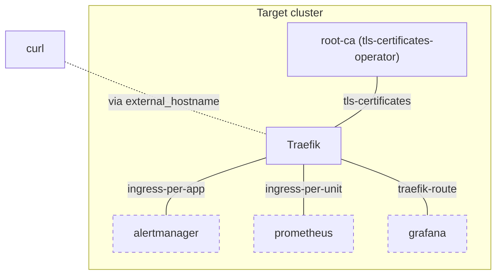

## Manual verifications

### TLS termination using a local root-ca

1. Relate `some-charm - traefik - tls-certificates-operator`.
2. Save root-ca certificate to disk:
   `juju show-unit --format json root-ca/0 | jq -r '."root-ca/0"."relation-info"[0]."application-data".self_signed_ca_certificate' > /tmp/local_root_ca.cert`
3. Curl the `some-charm` endpoint:
   `curl --resolve juju.local:443:$(juju status --format json traefik | jq -r ".applications.traefik.address") --capath /tmp --cacert /tmp/local_root_ca.cert https://juju.local/test-traefik-deployed-after-metallb-f7k6-alertmanager`
