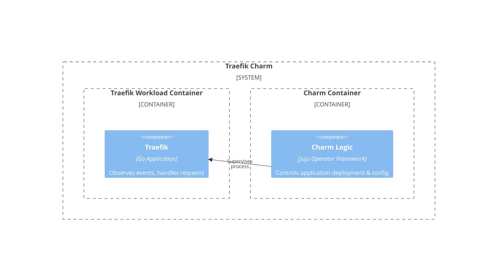

---
myst:
  html_meta:
    "description lang=en": "Learn more about the charm architecture of the Traefik charm."
---

(explanation_charm_architecture)=

# Charm architecture

At its core, [Traefik](https://traefik.io/traefik) is a [Go](https://go.dev/) application that 
provides both Layer 4 and Layer 7 traffic management, allowing applications to expose themselves outside their network boundary. The traefik-k8s charm deploys and manages Traefik as a Kubernetes ingress controller, routing requests from outside the cluster to Juju units and applications with support for TLS termination, path-based and subdomain-based routing, and much more.

## Charm architecture diagram



The charm design leverages the [sidecar](https://kubernetes.io/blog/2015/06/the-distributed-system-toolkit-patterns/#example-1-sidecar-containers) pattern to allow multiple containers in each pod with [Pebble](https://documentation.ubuntu.com/juju/3.6/reference/pebble/) running as the workload container's entrypoint.

Pebble is a lightweight, API-driven process supervisor that is responsible for configuring processes to run in a container and controlling those processes throughout the workload lifecycle.

Pebble `services` are configured through [layers](https://github.com/canonical/pebble#layer-specification), and the following layer forms the effective Pebble configuration, or `plan`:

1. **traefik** layer: runs the Traefik binary (`/usr/bin/traefik`) and pipes output to both stdout and a log file at `/var/log/traefik.log`.

As a result, if you run `kubectl get pods` on a namespace named for the Juju model you've deployed the traefik-k8s charm into, you'll see something like the following:

```bash
NAME                             READY   STATUS    RESTARTS   AGE
traefik-k8s-0                    2/2     Running   0          6h4m
```

This shows there are two containers: the workload container running Traefik (managed by Pebble) and the Juju agent sidecar container.

## Containers

### traefik

The `traefik` container runs the Traefik reverse proxy. It is configured with a `configurations` storage volume mounted at `/opt/traefik/`, which holds the dynamic configuration files that Traefik's [file provider](https://doc.traefik.io/traefik/providers/file/) watches for changes using `fsnotify`.

Key paths inside the container:

- `/etc/traefik/traefik.yaml` — the static configuration file (entrypoints, providers, API settings)
- `/opt/traefik/juju/` — dynamic configuration directory with per-route YAML files
- `/usr/bin/traefik` — the Traefik binary
- `/var/log/traefik.log` — log file
- `/usr/local/share/ca-certificates/` — trusted CA certificates

## OCI images

The traefik-k8s charm uses the official Ubuntu Traefik OCI image (`docker.io/ubuntu/traefik:2-22.04`). This source file of this OCI image is maintained at the [Traefik rock](https://github.com/canonical/traefik-rock) repository.
We use [Rockcraft](https://canonical-rockcraft.readthedocs-hosted.com/en/latest/) to build the OCI image for the Traefik charm. 
The image is published to [Charmhub](https://charmhub.io/traefik-k8s) as a charm resource.

See more: [How to publish your charm on Charmhub](https://documentation.ubuntu.com/charmcraft/stable/howto/manage-charms/#publish-a-charm-on-charmhub)

## Metrics

The charm exposes Prometheus metrics at the `/metrics` endpoint at the diagnostics port (8082). The `metrics-endpoint` relation enables Prometheus to scrape Traefik's built-in metrics. 

## Juju events

For this charm, the following Juju events are observed:

1. [`traefik_pebble_ready`](https://documentation.ubuntu.com/juju/3.6/reference/hook/index.html#container-pebble-ready): fired on Kubernetes charms when the requested container is ready. **Action**: configure and start the Traefik workload, write static/dynamic configuration, and replan the Pebble service.

2. [`config_changed`](https://documentation.ubuntu.com/juju/latest/reference/hook/index.html#config-changed): usually fired in response to a configuration change using the CLI. **Action**: regenerate Traefik static and dynamic configuration, update the Kubernetes LoadBalancer service, and restart the workload.

3. [`start`](https://documentation.ubuntu.com/juju/latest/reference/hook/index.html#start): fired once when the unit is first started. **Action**: perform initial setup tasks for the charm.

4. [`stop`](https://documentation.ubuntu.com/juju/latest/reference/hook/index.html#stop): fired when the unit is being stopped. **Action**: clean up resources.

5. [`remove`](https://documentation.ubuntu.com/juju/latest/reference/hook/index.html#remove): fired when the unit is being removed. **Action**: clean up Kubernetes resources such as the LoadBalancer service.

6. [`update_status`](https://documentation.ubuntu.com/juju/latest/reference/hook/index.html#update-status): fired at regular intervals. **Action**: validate the current state of the workload and update the charm status accordingly.

7. [`certificate_available`](https://github.com/canonical/tls-certificates-interface): fired when a TLS certificate becomes available from the certificates provider. **Action**: store the certificate and reconfigure Traefik with TLS settings.

8. [`certificates_relation_broken`](https://documentation.ubuntu.com/juju/latest/reference/hook/index.html#endpoint-relation-departed): fired when the TLS certificates relation is removed. **Action**: clean up TLS configuration and restart Traefik without TLS.

9. [`certificate_set_updated`](https://github.com/canonical/certificate-transfer-interface): fired when a CA certificate is received via the `receive-ca-cert` relation. **Action**: update the trusted CA certificates in the container and run `update-ca-certificates`.

10. [`auth_config_changed`](https://github.com/canonical/oathkeeper-operator): fired when forward-auth configuration changes. **Action**: reconfigure the ForwardAuth middleware for all proxied routes.

11. [`auth_config_removed`](https://github.com/canonical/oathkeeper-operator): fired when forward-auth configuration is removed. **Action**: remove the ForwardAuth middleware from proxied routes.

12. [`ingress data_provided`](https://github.com/canonical/traefik-k8s-operator): fired when an ingress requirer provides routing data (applies to `ingress`, `ingress-per-unit`, and `ingress-per-app` relations). **Action**: generate dynamic routing configuration for the requesting application.

13. [`ingress data_removed`](https://github.com/canonical/traefik-k8s-operator): fired when an ingress requirer removes its routing data. **Action**: delete the corresponding dynamic routing configuration.

14. [`traefik_route ready`](https://github.com/canonical/traefik-k8s-operator): fired when a traefik-route charm provides raw Traefik configuration. **Action**: write the provided configuration to the dynamic config directory.

15. [`show_proxied_endpoints`](https://documentation.ubuntu.com/juju/latest/user/reference/action/): fired when the `show-proxied-endpoints` action is run. **Action**: display all currently configured ingress routes.

> See more in the Juju docs: [Hook](https://documentation.ubuntu.com/juju/latest/reference/hook/)

## Charm code overview

The `src/charm.py` is the default entry point for a charm and has the `TraefikIngressCharm` Python class which inherits from `CharmBase`. `CharmBase` is the base class from which all charms are formed, defined by [Ops](https://ops.readthedocs.io/en/latest/index.html) (Python framework for developing charms).

> See more in the Juju docs: [Charm](https://documentation.ubuntu.com/juju/latest/user/reference/charm/)

The `__init__` method guarantees that the charm observes all events relevant to its operation and handles them.

Take, for example, when a configuration is changed by using the CLI.

1. User runs the configuration command:

```bash
juju config traefik-k8s routing_mode=subdomain
```

2. A `config-changed` event is emitted.
3. In the `__init__` method is defined how to handle this event like this:

```python
self.framework.observe(self.on.config_changed, self._on_change)
```

4. The method `_on_change`, for its turn, will take the necessary actions such as waiting for all the relations to be ready, regenerating the Traefik static and dynamic configuration, and replanning the Pebble service.

